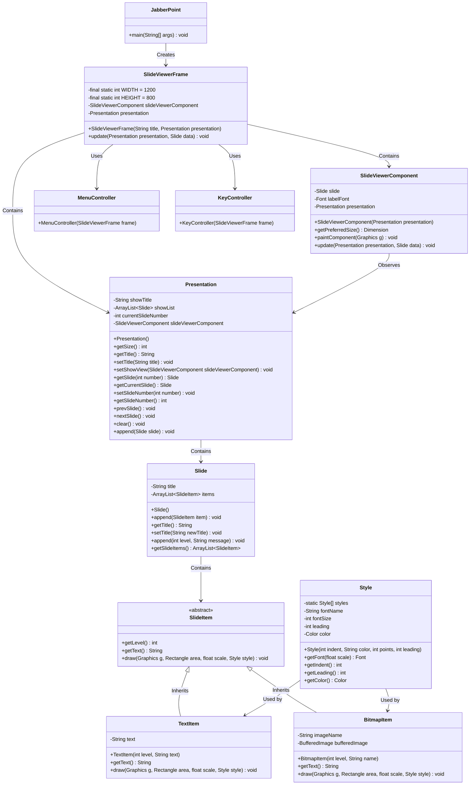

# Software Quality

<h1 align="center">
  <a href="https://www.nhlstenden.com/"></a>
</h1>
This project, developed for NHL Stenden University by Yunus Karakoc and Elmedin Arifi, focuses on improving and optimizing existing Java code.  The project emphasizes software quality principles through rigorous testing, analysis, and code re-optimization.

## Project Overview

The primary goal of this project is to enhance the quality and performance of Java code. This involves:

* **Testing:** Implementing and executing tests to identify areas for improvement and ensure code correctness.  *(Expand on the specific types of testing you intend to do here as you develop the project)*
* **Analysis:** Performing static and dynamic analysis to identify potential issues, inefficiencies, and areas for optimization. *(Specify the analysis tools or methods you plan to use)*
* **Re-optimization:** Refactoring and optimizing the code based on the analysis results to improve performance, maintainability, and overall quality.

## Technologies Used

* Java
* Docker

## Development Team

* Elmedin Arifi
* Yunus Karakoc

## Class Diagram Concept


## Getting Started (Using Docker)

This project is designed to be run exclusively within a Docker container.  Follow these steps to get started:

1. **Prerequisites:** Ensure you have Docker installed on your system.  You can download and install Docker from [https://www.docker.com/](https://www.docker.com/).

2. **Building the Docker Image:** Navigate to the project directory in your terminal and run the following command to build the Docker image:

   ```bash
   docker build -t software-quality-project .
