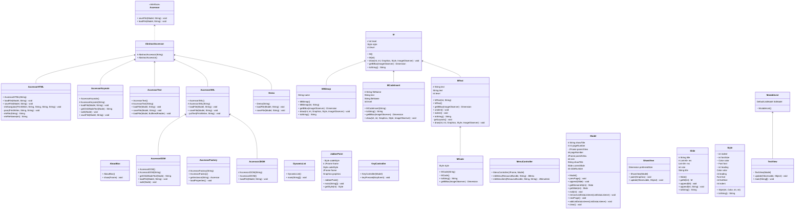

```mermaid
classDiagram
direction BT
class AboutBox {
  + AboutBox() 
  + show(Frame) void
}
class AbstractAccessor {
  # AbstractAccessor(String) 
  + AbstractAccessor() 
}
class Accessor {
<<Interface>>
  + saveFile(Model, String) void
  + loadFile(Model, String) void
}
class AccessorDOM {
  + AccessorDOM() 
  # AccessorDOM(String) 
  ~ getChildNodeText(Node) String
  + loadFile(Model, String) void
  ~ walk(Node) void
}
class AccessorFactory {
  # AccessorFactory(String) 
  + AccessorFactory() 
  + getInstance(String) Accessor
  ~ loadProperties() void
}
class AccessorHTML {
  + AccessorHTML(String) 
  + loadFile(Model, String) void
  + saveFile(Model, String) void
  - mkNavigator(PrintWriter, String, String, String, String) void
  - para(PrintWriter, String, String) void
  - mkFile(String) String
  - mkFileName(int) String
}
class AccessorJDOM {
  # AccessorJDOM(String) 
  + AccessorJDOM() 
  + loadFile(Model, String) void
}
class AccessorKeynote {
  + AccessorKeynote() 
  # AccessorKeynote(String) 
  + loadFile(Model, String) void
  ~ getChildNodeText(Node) String
  ~ walk(Node) void
  + saveFile(Model, String) void
}
class AccessorText {
  + AccessorText() 
  # AccessorText(String) 
  + loadFile(Model, String) void
  + saveFile(Model, String) void
  + loadFile(Model, BufferedReader) void
}
class AccessorXML {
  + AccessorXML() 
  # AccessorXML(String) 
  + loadFile(Model, String) void
  + saveFile(Model, String) void
  - putText(PrintWriter, String) void
}
class Demo {
  ~ Demo(String) 
  + loadFile(Model, String) void
  + saveFile(Model, String) void
}
class DynamicList {
  + DynamicList() 
  + main(String[]) void
}
class JabberPoint {
  ~ JabberPoint() 
  - Style codeStyle
  # JFrame frame
  + main(String[]) void
  + getStyle(int) Style
   Style codeStyle
   JFrame frame
   Graphics graphics
}
class KeyController {
  + KeyController(Model) 
  + keyPressed(KeyEvent) void
}
class M {
  + M() 
  + M(int) 
  # int level
  + draw(int, int, Graphics, Style, ImageObserver) void
  + getBBox(ImageObserver) Dimension
  + toString() String
   Style style
   int level
}
class MBitmap {
  + MBitmap() 
  + MBitmap(int, String) 
  + getBBox(ImageObserver) Dimension
  + draw(int, int, Graphics, Style, ImageObserver) void
  + toString() String
   String name
}
class MCode {
  + MCode(String) 
  ~ MCode() 
  + toString() String
  + getBBox(ImageObserver) Dimension
   Style style
}
class MCodeInsert {
  + MCodeInsert(String) 
  # String fileName
  + toString() String
  + getBBox(ImageObserver) Dimension
  + draw(int, int, Graphics, Style, ImageObserver) void
   String text
   String fileName
   int level
}
class MText {
  + MText(int, String) 
  + MText() 
  # String text
  + getBBox(ImageObserver) Dimension
  + undent() void
  + indent() void
  + toString() String
  - getLayouts() void
  + draw(int, int, Graphics, Style, ImageObserver) void
   String text
   int level
}
class MenuController {
  + MenuController(JFrame, Model) 
  + mkMenu(ResourceBundle, String) JMenu
  + mkMenuItem(ResourceBundle, String, String) JMenuItem
}
class Model {
  + Model() 
  # String showTitle
  # int pageNumber
  - JFrame parentView
  + prevPage() void
  + append(Slide) void
  + getElementAt(int) Slide
  + getSlide(int) Slide
  + exit(int) void
  + removeListDataListener(ListDataListener) void
  + nextPage() void
  + addListDataListener(ListDataListener) void
  + clear() void
   int pageNumber
   JFrame parentView
   int size
   String showTitle
   Slide currentSlide
   int slideNumber
}
class MutableList {
  ~ MutableList() 
   DefaultListModel listModel
}
class ShowView {
  ~ ShowView(Model) 
  + paint(Graphics) void
  + update(Observable, Object) void
   Dimension preferredSize
}
class Slide {
  + Slide() 
  # String title
  # List~M~ ms
  + getM(int) M
  + append(M) void
  + append(int, String) void
  + toString() String
   List~M~ ms
   int size
   String title
}
class Style {
  + Style(int, Color, int, int) 
  ~ int indent
  ~ int fontSize
  ~ Color color
  ~ Font font
  ~ int leading
  + toString() String
   Color color
   int leading
   Font font
   int fontSize
   int indent
}
class TextView {
  ~ TextView(Model) 
  + update(Observable, Object) void
  + main(String[]) void
}

AbstractAccessor  ..>  Accessor 
AccessorDOM  -->  AccessorXML 
AccessorHTML  -->  AbstractAccessor 
AccessorJDOM  -->  AccessorXML 
AccessorKeynote  -->  AbstractAccessor 
AccessorText  -->  AbstractAccessor 
AccessorXML  -->  AbstractAccessor 
Demo  -->  AbstractAccessor 
MBitmap  -->  M 
MCode  -->  MText 
MCodeInsert  -->  M 
MText  -->  M 
TextView  -->  MutableList 
```
